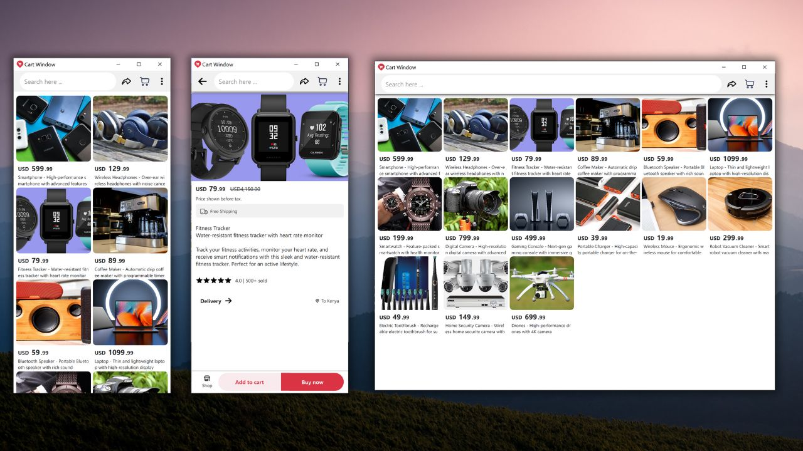

# Shopping App Qt/QML
This is a shopping app UI sample, just a bit of it not a functional complete app. Build with Qt/QML using Qt 6.6. Current design is mobile-centric but allows for dynamic screen resizing layout on the products page.

# Screenshot

# Running
- Qt Creator (Qt 6.6)
- Build & Run

# Disclaimer
Product photos used are collected from the web, I do not own any rights to them!
